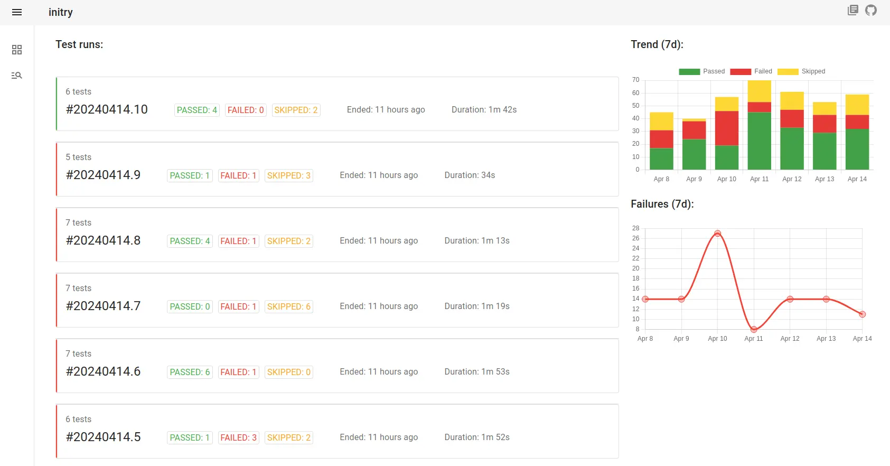

# initry
**initry** is a reporting system for test automation frameworks. It stores test results and has user-frinedly web interface for reviewing.

## How It Works
A test automation framework executes test cases and sends test details to **initry**. **initry** is bundled with a special `middleware`, a plugin for a specific test framework. Middleware operates as a mediator between framework and **initry**. Test results from the framework are parsed to **initry** via plugin, then **initry** stores data in the database.

### `pytest` example
1. `pytest` - test framework is installed
2. `pytest-initry` - middleware is installed (a plugin for `pytest`)
3. `pytest.ini` - a configuration file for `pytest` that includes the plugin settings and located in the tests directory

On `pytest` run:
***pytest results*** parsed to ***pytest-initry plugin*** then to ***initry*** and stored in the ***database***.

## Features
- Web Application
- Works with [MongoDB](https://www.mongodb.com/) Database
- Works with [Redis](https://redis.io/)
- Uses [gRPC](https://grpc.io/)

## Supported Test Automation Frameworks
| Framework                      | Middleware                                                 |
| ------------------------------ | ---------------------------------------------------------- |
| [pytest](https://pytest.org/)  | [pytest-initry](https://github.com/initry/pytest-initry/)  |

## Documentation
- [Installation](https://initry.io/)
